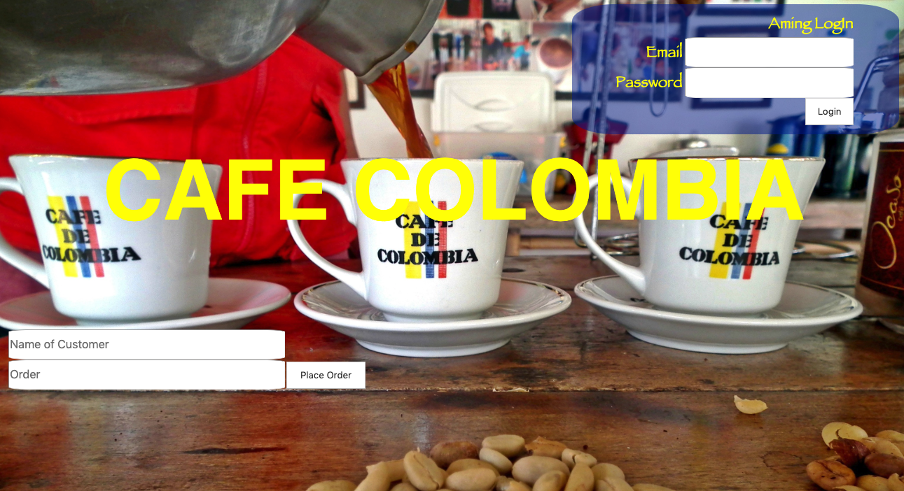

#  ☕️ Barrista-App
### This application allows cashiers to input customer orders.  That will be accessed only by the baristas.  The baristas when they are logged in will be able to see the order.  When they have completed the order the application tags the baristas name to the completed drink.  Then the machine announces the name of the completed drink and the customer name.

## Tech Used:
- HTML5
- CSS3
- Javascript
- Node.js
- Express
- Mongo DB
- say.js

## Installation

1. Clone repo
2. run `npm install`

## Usage

1. run `node server.js`
2. Navigate to `localhost:4000`
3. Have fun ;)

## Credit

Modified from Scotch.io's auth tutorial
